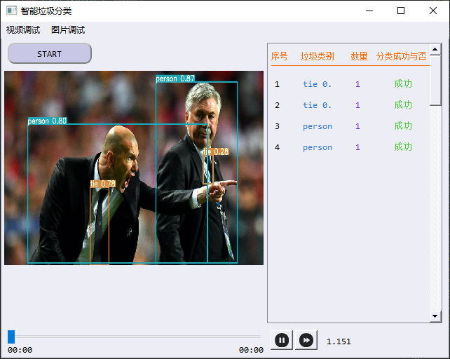

## 项目版本V1.0，更新至2022/2/15

### yolov5本地版本

作为工训竞赛-智能垃圾分类赛项识别算法以及gui的前置项目


### 简要介绍

#### 实现环境

```
Package                 Version
----------------------- -----------
ipython                 7.31.1
matplotlib              3.5.1
matplotlib-inline       0.1.3
numpy                   1.21.5
opencv-python           4.5.5.62
Pillow                  9.0.0
PyQt5                   5.15.6
PyYAML                  6.0
scipy                   1.7.3
tensorboard             2.8.0
torch                   1.7.0+cu110
torchvision             0.8.0
tqdm                    4.62.3
```


#### 项目文件结构

```
C:.
├─data
│  ├─images
│  └─scripts
├─models
│  ├─hub
│  └─__pycache__
├─pic
├─runs
│  └─detect
│      ├─exp
│      ├─exp2
│      └─exp3
├─utils
│  ├─google_app_engine
│  └─__pycache__
├─weights
└─__pycache__
```

data中存放了测试的图片目录

models中存放了yolov5的模型文件

runs中存放了测试得到图片文件

weights中存放了预训练的权重文件（未放在仓库中）


#### 使用方法

命令行下输入开启正常检测模式

```
python detect.py
```

输入开始本地摄像头检测模式

```
python detect.py --source 0
```


#### 本地改进

命令行下输入开启gui版本

```
python detect_gui.py
```

融合gui版本的yolov5图像识别版本，适配工训竞赛，gui采用pyqt5编写，yolov5使用预训练模型，未进行自己的模型训练。

gui界面如下：


点击start进行识别，并在旁边窗口进行显示



视频功能并未更新